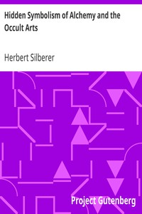

# Hidden Symbolism of Alchemy and the Occult Arts <kbd>v2.2.1</kbd>

## Authors

 - Silberer, Herbert <small>(1882 - 1922)</small>

## Translators

 - Jelliffe, Smith Ely <small>(1866 - 1945)</small>

## Subjects

 - Alchemy
 - Society of Rosicrucians
 - Symbolism (Psychology)

## Readablility

 - **A1:** 73%
 - **A2:** 79%
 - **B1:** 85%
 - **B2:** 91%
 - **C1:** 96%
 - **C2:** 100%

## Words Count

 - **A1:** 491
 - **A2:** 464
 - **B1:** 857
 - **B2:** 1361
 - **C1:** 1662
 - **C2:** 1312

## Source

<kbd>GUTHENBURGE:27755</kbd>
