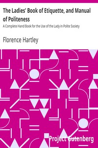

# The Ladies' Book of Etiquette, and Manual of Politeness: A Complete Hand Book for the Use of the Lady in Polite Society <kbd>v2.2.1</kbd>

## Authors

 - Hartley, Florence <small>(-1 - -1)</small>

## Translators

## Subjects

 - Etiquette
 - Etiquette for women
 - Formulas, recipes, etc.

## Readablility

 - **A1:** 71%
 - **A2:** 78%
 - **B1:** 85%
 - **B2:** 91%
 - **C1:** 97%
 - **C2:** 100%

## Words Count

 - **A1:** 479
 - **A2:** 455
 - **B1:** 841
 - **B2:** 1319
 - **C1:** 1668
 - **C2:** 1061

## Source

<kbd>GUTHENBURGE:35123</kbd>
