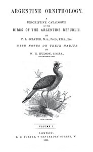

# Argentine Ornithology, Volume 1 (of 2): A descriptive catalogue of the birds of the Argentine Republic. <kbd>v2.2.1</kbd>

## Authors

 - Hudson, W. H. (William Henry) <small>(1841 - 1922)</small>
 - Sclater, Philip Lutley <small>(1829 - 1913)</small>

## Translators

## Subjects

 - Birds

## Readablility

 - **A1:** 70%
 - **A2:** 76%
 - **B1:** 84%
 - **B2:** 92%
 - **C1:** 97%
 - **C2:** 100%

## Words Count

 - **A1:** 467
 - **A2:** 395
 - **B1:** 678
 - **B2:** 972
 - **C1:** 1082
 - **C2:** 708

## Source

<kbd>GUTHENBURGE:38956</kbd>
