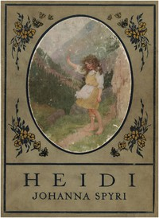

# Heidi: (Gift Edition) <kbd>v2.3.0</kbd>

## Authors

 - Spyri, Johanna <small>(1827 - 1901)</small>

## Translators

 - Stork, Elisabeth P. (Elisabeth Pausinger) <small>(-1 - -1)</small>

## Subjects

 - Grandfathers
 - Mountain life
 - Orphans
 - Switzerland

## Readablility

 - **A1:** 79%
 - **A2:** 85%
 - **B1:** 91%
 - **B2:** 96%
 - **C1:** 99%
 - **C2:** 100%

## Words Count

 - **A1:** 480
 - **A2:** 422
 - **B1:** 672
 - **B2:** 881
 - **C1:** 781
 - **C2:** 269

## Source

<kbd>GUTHENBURGE:20781</kbd>
