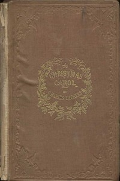

# A Christmas Carol in Prose; Being a Ghost Story of Christmas <kbd>v2.2.1</kbd>

## Authors

 - Dickens, Charles <small>(1812 - 1870)</small>

## Translators

## Subjects

 - Christmas stories
 - Ghost stories
 - London (England)
 - Misers
 - Poor families
 - Scrooge, Ebenezer (Fictitious character)
 - Sick children

## Readablility

 - **A1:** 76%
 - **A2:** 82%
 - **B1:** 88%
 - **B2:** 93%
 - **C1:** 98%
 - **C2:** 100%

## Words Count

 - **A1:** 485
 - **A2:** 433
 - **B1:** 654
 - **B2:** 834
 - **C1:** 865
 - **C2:** 492

## Source

<kbd>GUTHENBURGE:46</kbd>
