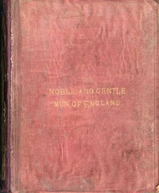

# The Noble and Gentle Men of England: or, notes touching the arms and descents of the ancient knightly and gentle houses of England, arranged in their respective counties. <kbd>v2.2.1</kbd>

## Authors

 - Shirley, Evelyn Philip <small>(1812 - 1882)</small>

## Translators

## Subjects

 - Great Britain
 - Heraldry
 - Nobility

## Readablility

 - **A1:** 77%
 - **A2:** 81%
 - **B1:** 85%
 - **B2:** 92%
 - **C1:** 96%
 - **C2:** 99%

## Words Count

 - **A1:** 393
 - **A2:** 269
 - **B1:** 411
 - **B2:** 512
 - **C1:** 515
 - **C2:** 288

## Source

<kbd>GUTHENBURGE:58212</kbd>
