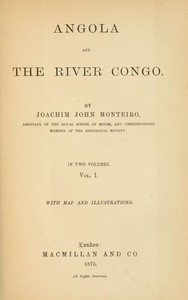

# Angola and the River Congo, vol. 1 <kbd>v2.2.1</kbd>

## Authors

 - Monteiro, Joachim John <small>(1833 - 1878)</small>

## Translators

## Subjects

 - Angola
 - Congo River

## Readablility

 - **A1:** 72%
 - **A2:** 78%
 - **B1:** 86%
 - **B2:** 92%
 - **C1:** 97%
 - **C2:** 100%

## Words Count

 - **A1:** 480
 - **A2:** 452
 - **B1:** 813
 - **B2:** 1186
 - **C1:** 1361
 - **C2:** 871

## Source

<kbd>GUTHENBURGE:68110</kbd>
