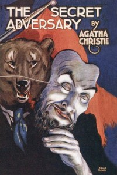

# The Secret Adversary <kbd>v2.0.2</kbd>

## Authors

 - Christie, Agatha <small>(1890 - 1976)</small>

## Translators

## Subjects

 - Beresford, Tommy (Fictitious character)
 - Beresford, Tuppence (Fictitious character)
 - Detective and mystery stories
 - Domestic fiction
 - Married people
 - Missing persons
 - Private investigators

## Readablility

 - **A1:** 52%
 - **A2:** 59%
 - **B1:** 69%
 - **B2:** 81%
 - **C1:** 85%
 - **C2:** 100%

## Words Count

 - **A1:** 567
 - **A2:** 513
 - **B1:** 875
 - **B2:** 1294
 - **C1:** 566
 - **C2:** 3249

## Source

<kbd>GUTHENBURGE:1155</kbd>
