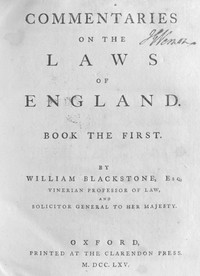

# Commentaries on the Laws of England, Book the First <kbd>v2.3.0</kbd>

## Authors

 - Blackstone, William, Sir <small>(1723 - 1780)</small>

## Translators

## Subjects

 - Law
 - Law

## Readablility

 - **A1:** 74%
 - **A2:** 80%
 - **B1:** 86%
 - **B2:** 92%
 - **C1:** 97%
 - **C2:** 100%

## Words Count

 - **A1:** 477
 - **A2:** 432
 - **B1:** 769
 - **B2:** 1226
 - **C1:** 1614
 - **C2:** 1299

## Source

<kbd>GUTHENBURGE:30802</kbd>
