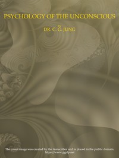

# Psychology of the Unconscious: A Study of the Transformations and Symbolisms of the Libido. A Contribution to the History of the Evolution of Thought <kbd>v2.3.0</kbd>

## Authors

 - Jung, C. G. (Carl Gustav) <small>(1875 - 1961)</small>

## Translators

 - Hinkle, Beatrice M. <small>(1874 - 1953)</small>

## Subjects

 - Libido (Psychology)
 - Mother and child
 - Psychoanalysis
 - Subconsciousness
 - Symbolism (Psychology)

## Readablility

 - **A1:** 73%
 - **A2:** 78%
 - **B1:** 84%
 - **B2:** 91%
 - **C1:** 96%
 - **C2:** 100%

## Words Count

 - **A1:** 494
 - **A2:** 476
 - **B1:** 904
 - **B2:** 1553
 - **C1:** 2113
 - **C2:** 1873

## Source

<kbd>GUTHENBURGE:65903</kbd>
