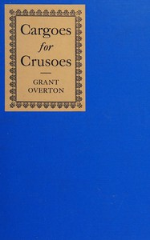

# Cargoes for Crusoes <kbd>v2.2.1</kbd>

## Authors

 - Overton, Grant M. (Grant Martin) <small>(1887 - 1930)</small>

## Translators

## Subjects

 - American literature
 - English literature
 - English-speaking countries

## Readablility

 - **A1:** 74%
 - **A2:** 80%
 - **B1:** 86%
 - **B2:** 92%
 - **C1:** 97%
 - **C2:** 100%

## Words Count

 - **A1:** 493
 - **A2:** 491
 - **B1:** 935
 - **B2:** 1557
 - **C1:** 2060
 - **C2:** 1650

## Source

<kbd>GUTHENBURGE:68092</kbd>
