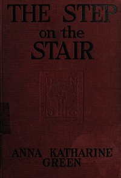

# The step on the stair <kbd>v2.3.0</kbd>

## Authors

 - Green, Anna Katharine <small>(1846 - 1935)</small>

## Translators

## Subjects

 - Cousins
 - Detective and mystery stories
 - Inheritance and succession
 - Man-woman relationships
 - Murder

## Readablility

 - **A1:** 79%
 - **A2:** 85%
 - **B1:** 91%
 - **B2:** 95%
 - **C1:** 99%
 - **C2:** 100%

## Words Count

 - **A1:** 487
 - **A2:** 456
 - **B1:** 814
 - **B2:** 1302
 - **C1:** 1433
 - **C2:** 894

## Source

<kbd>GUTHENBURGE:68153</kbd>
