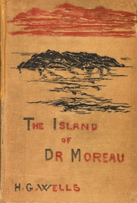

# The Island of Doctor Moreau <kbd>v2.3.0</kbd>

## Authors

 - Wells, H. G. (Herbert George) <small>(1866 - 1946)</small>

## Translators

## Subjects

 - Animal experimentation
 - Islands
 - Science fiction
 - Shipwreck survival

## Readablility

 - **A1:** 75%
 - **A2:** 81%
 - **B1:** 87%
 - **B2:** 93%
 - **C1:** 97%
 - **C2:** 100%

## Words Count

 - **A1:** 471
 - **A2:** 425
 - **B1:** 675
 - **B2:** 987
 - **C1:** 1040
 - **C2:** 670

## Source

<kbd>GUTHENBURGE:159</kbd>
