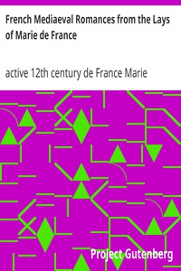

# French Mediaeval Romances from the Lays of Marie de France <kbd>v2.2.1</kbd>

## Authors

 - Marie, de France, active 12th century <small>(-1 - -1)</small>

## Translators

 - Mason, Eugene <small>(-1 - -1)</small>

## Subjects

 - Lays
 - Marie, de France, active 12th century
 - Romances

## Readablility

 - **A1:** 78%
 - **A2:** 83%
 - **B1:** 89%
 - **B2:** 94%
 - **C1:** 99%
 - **C2:** 100%

## Words Count

 - **A1:** 486
 - **A2:** 428
 - **B1:** 690
 - **B2:** 924
 - **C1:** 941
 - **C2:** 481

## Source

<kbd>GUTHENBURGE:11417</kbd>
