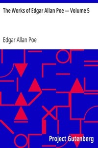

# The Works of Edgar Allan Poe — Volume 5 <kbd>v2.3.0</kbd>

## Authors

 - Poe, Edgar Allan <small>(1809 - 1849)</small>

## Translators

## Subjects

 - American fiction
 - American poetry
 - Fantasy fiction
 - Horror tales, American

## Readablility

 - **A1:** 74%
 - **A2:** 79%
 - **B1:** 85%
 - **B2:** 92%
 - **C1:** 97%
 - **C2:** 100%

## Words Count

 - **A1:** 495
 - **A2:** 480
 - **B1:** 891
 - **B2:** 1470
 - **C1:** 1801
 - **C2:** 1350

## Source

<kbd>GUTHENBURGE:2151</kbd>
