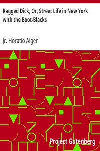

# Ragged Dick, Or, Street Life in New York with the Boot-Blacks <kbd>v2.3.0</kbd>

## Authors

 - Alger, Horatio, Jr. <small>(1832 - 1899)</small>

## Translators

## Subjects

 - Bildungsromans
 - Boys
 - New York (N.Y.)
 - Poor children
 - Shoe shiners
 - Street children

## Readablility

 - **A1:** 76%
 - **A2:** 82%
 - **B1:** 90%
 - **B2:** 95%
 - **C1:** 99%
 - **C2:** 100%

## Words Count

 - **A1:** 484
 - **A2:** 426
 - **B1:** 702
 - **B2:** 953
 - **C1:** 887
 - **C2:** 394

## Source

<kbd>GUTHENBURGE:5348</kbd>
