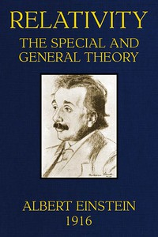

# Relativity : the Special and General Theory <kbd>v2.3.0</kbd>

## Authors

 - Einstein, Albert <small>(1879 - 1955)</small>

## Translators

 - Lawson, Robert W. (Robert William) <small>(-1 - -1)</small>

## Subjects

 - Relativity (Physics)

## Readablility

 - **A1:** 72%
 - **A2:** 78%
 - **B1:** 85%
 - **B2:** 92%
 - **C1:** 96%
 - **C2:** 100%

## Words Count

 - **A1:** 401
 - **A2:** 259
 - **B1:** 382
 - **B2:** 517
 - **C1:** 496
 - **C2:** 313

## Source

<kbd>GUTHENBURGE:5001</kbd>
