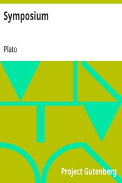

# Symposium <kbd>v2.0.2</kbd>

## Authors

 - Plato <small>(-428 - -348)</small>

## Translators

 - Jowett, Benjamin <small>(1817 - 1893)</small>

## Subjects

 - Classical literature
 - Love
 - Philosophy, Ancient
 - Socrates, 470 BC-399 BC

## Readablility

 - **A1:** 56%
 - **A2:** 62%
 - **B1:** 72%
 - **B2:** 87%
 - **C1:** 90%
 - **C2:** 100%

## Words Count

 - **A1:** 496
 - **A2:** 400
 - **B1:** 599
 - **B2:** 859
 - **C1:** 298
 - **C2:** 1622

## Source

<kbd>GUTHENBURGE:1600</kbd>
