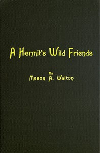

# A Hermit's Wild Friends; or, Eighteen Years in the Woods <kbd>v2.2.1</kbd>

## Authors

 - Walton, Mason Augustus <small>(1838 - -1)</small>

## Translators

## Subjects

 - Animal behavior
 - Zoology

## Readablility

 - **A1:** 72%
 - **A2:** 79%
 - **B1:** 86%
 - **B2:** 92%
 - **C1:** 97%
 - **C2:** 100%

## Words Count

 - **A1:** 474
 - **A2:** 425
 - **B1:** 722
 - **B2:** 993
 - **C1:** 995
 - **C2:** 554

## Source

<kbd>GUTHENBURGE:67906</kbd>
