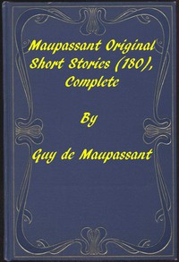

# Complete Original Short Stories of Guy De Maupassant <kbd>GUTHENBURGE</kbd>

## Authors

 - Maupassant, Guy de <small>(1850 - 1893)</small>

## Translators

 - Quesada, Louise Charlotte Garstin <small>(-1 - -1)</small>
 - Henderson, A. E. <small>(-1 - -1)</small>
 - McMaster, Albert Cohn <small>(-1 - -1)</small>

## Subjects

 - French fiction
 - Short stories, French

## Readablility

 - **A1:** 49%
 - **A2:** 63%
 - **B1:** 76%
 - **B2:** 87%
 - **C1:** 96%
 - **C2:** 100%

## Words Count

 - **A1:** 408
 - **A2:** 489
 - **B1:** 971
 - **B2:** 1894
 - **C1:** 3138
 - **C2:** 3516
