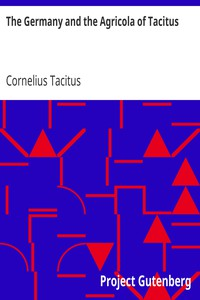

# The Germany and the Agricola of Tacitus <kbd>v2.3.0</kbd>

## Authors

 - Tacitus, Cornelius <small>(56 - 117)</small>

## Translators

## Subjects

 - Agricola, Gnaeus Julius, 40-93
 - Germanic peoples
 - Statesmen

## Readablility

 - **A1:** 74%
 - **A2:** 80%
 - **B1:** 86%
 - **B2:** 92%
 - **C1:** 98%
 - **C2:** 100%

## Words Count

 - **A1:** 479
 - **A2:** 418
 - **B1:** 720
 - **B2:** 1089
 - **C1:** 1236
 - **C2:** 726

## Source

<kbd>GUTHENBURGE:7524</kbd>
