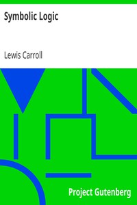

# Symbolic Logic <kbd>v2.2.1</kbd>

## Authors

 - Carroll, Lewis <small>(1832 - 1898)</small>

## Translators

## Subjects

 - Logic, Symbolic and mathematical

## Readablility

 - **A1:** 77%
 - **A2:** 82%
 - **B1:** 88%
 - **B2:** 94%
 - **C1:** 97%
 - **C2:** 100%

## Words Count

 - **A1:** 443
 - **A2:** 323
 - **B1:** 513
 - **B2:** 604
 - **C1:** 582
 - **C2:** 335

## Source

<kbd>GUTHENBURGE:28696</kbd>
