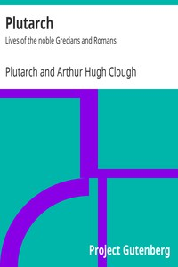

# Plutarch: Lives of the noble Grecians and Romans <kbd>v2.2.1</kbd>

## Authors

 - Plutarch <small>(46 - 119)</small>

## Translators

## Subjects

 - Greece
 - Rome

## Readablility

 - **A1:** 78%
 - **A2:** 84%
 - **B1:** 89%
 - **B2:** 94%
 - **C1:** 98%
 - **C2:** 100%

## Words Count

 - **A1:** 491
 - **A2:** 487
 - **B1:** 960
 - **B2:** 1808
 - **C1:** 2904
 - **C2:** 2893

## Source

<kbd>GUTHENBURGE:674</kbd>
