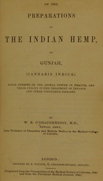

# On the Preparations of the Indian Hemp, or Gunjah (Cannabis Indica): Their Effects on the Animal System in Health, and Their Utility in the Treatment of Tetanus and Other Convulsive Diseases <kbd>v2.2.1</kbd>

## Authors

 - O'Shaughnessy, W. B. <small>(1809 - 1889)</small>

## Translators

## Subjects

 - Cannabis
 - Cannabis

## Readablility

 - **A1:** 69%
 - **A2:** 75%
 - **B1:** 82%
 - **B2:** 90%
 - **C1:** 96%
 - **C2:** 100%

## Words Count

 - **A1:** 388
 - **A2:** 283
 - **B1:** 436
 - **B2:** 571
 - **C1:** 474
 - **C2:** 294

## Source

<kbd>GUTHENBURGE:67959</kbd>
