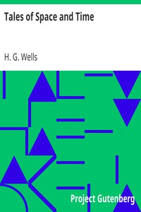

# Tales of Space and Time <kbd>v2.2.1</kbd>

## Authors

 - Wells, H. G. (Herbert George) <small>(1866 - 1946)</small>

## Translators

## Subjects

 - Science fiction, English

## Readablility

 - **A1:** 75%
 - **A2:** 81%
 - **B1:** 87%
 - **B2:** 93%
 - **C1:** 97%
 - **C2:** 100%

## Words Count

 - **A1:** 488
 - **A2:** 473
 - **B1:** 849
 - **B2:** 1340
 - **C1:** 1567
 - **C2:** 1141

## Source

<kbd>GUTHENBURGE:27365</kbd>
