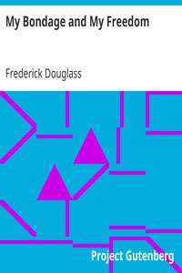

# My Bondage and My Freedom <kbd>v2.3.0</kbd>

## Authors

 - Douglass, Frederick <small>(1818 - 1895)</small>

## Translators

## Subjects

 - Abolitionists
 - African American abolitionists
 - Antislavery movements
 - Douglass, Frederick, 1818-1895
 - Fugitive slaves
 - Plantation life
 - Slaves

## Readablility

 - **A1:** 74%
 - **A2:** 81%
 - **B1:** 87%
 - **B2:** 93%
 - **C1:** 98%
 - **C2:** 100%

## Words Count

 - **A1:** 493
 - **A2:** 490
 - **B1:** 948
 - **B2:** 1671
 - **C1:** 2268
 - **C2:** 1477

## Source

<kbd>GUTHENBURGE:202</kbd>
