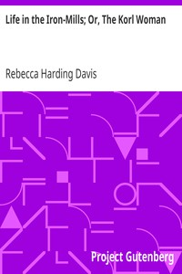

# Life in the Iron-Mills; Or, The Korl Woman <kbd>v2.2.1</kbd>

## Authors

 - Davis, Rebecca Harding <small>(1831 - 1910)</small>

## Translators

## Subjects

 - Feminism
 - Women iron and steel workers

## Readablility

 - **A1:** 74%
 - **A2:** 81%
 - **B1:** 87%
 - **B2:** 93%
 - **C1:** 98%
 - **C2:** 100%

## Words Count

 - **A1:** 459
 - **A2:** 342
 - **B1:** 481
 - **B2:** 605
 - **C1:** 520
 - **C2:** 263

## Source

<kbd>GUTHENBURGE:876</kbd>
