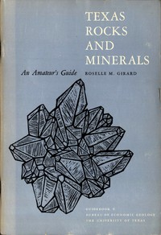

# Texas Rocks and Minerals: An Amateur's Guide <kbd>v2.3.0</kbd>

## Authors

 - Girard, Roselle M. <small>(1918 - -1)</small>

## Translators

## Subjects

 - Mineralogy
 - Petrology
 - Petrology

## Readablility

 - **A1:** 66%
 - **A2:** 71%
 - **B1:** 79%
 - **B2:** 86%
 - **C1:** 93%
 - **C2:** 99%

## Words Count

 - **A1:** 368
 - **A2:** 246
 - **B1:** 369
 - **B2:** 478
 - **C1:** 471
 - **C2:** 370

## Source

<kbd>GUTHENBURGE:52839</kbd>
