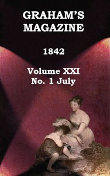

# Graham's Magazine, Vol. XXI, No. 1, July 1842 <kbd>v2.3.0</kbd>

## Authors

 - Various <small>(-1 - -1)</small>

## Translators

## Subjects

 - Literature
 - Literature, Modern

## Readablility

 - **A1:** 71%
 - **A2:** 78%
 - **B1:** 85%
 - **B2:** 91%
 - **C1:** 97%
 - **C2:** 100%

## Words Count

 - **A1:** 494
 - **A2:** 476
 - **B1:** 903
 - **B2:** 1444
 - **C1:** 1807
 - **C2:** 1151

## Source

<kbd>GUTHENBURGE:67962</kbd>
