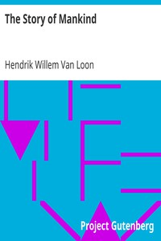

# The Story of Mankind <kbd>v2.0.2</kbd>

## Authors

 - Van Loon, Hendrik Willem <small>(1882 - 1944)</small>

## Translators

## Subjects

 - World history
 - World history

## Readablility

 - **A1:** 54%
 - **A2:** 61%
 - **B1:** 71%
 - **B2:** 84%
 - **C1:** 88%
 - **C2:** 100%

## Words Count

 - **A1:** 612
 - **A2:** 627
 - **B1:** 1107
 - **B2:** 1739
 - **C1:** 769
 - **C2:** 5451

## Source

<kbd>GUTHENBURGE:754</kbd>
