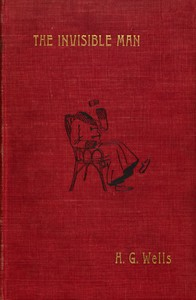

# The Invisible Man: A Grotesque Romance <kbd>v2.0.2</kbd>

## Authors

 - Wells, H. G. (Herbert George) <small>(1866 - 1946)</small>

## Translators

## Subjects

 - Mentally ill
 - Psychological fiction
 - Science fiction
 - Scientists

## Readablility

 - **A1:** 52%
 - **A2:** 58%
 - **B1:** 68%
 - **B2:** 82%
 - **C1:** 86%
 - **C2:** 100%

## Words Count

 - **A1:** 531
 - **A2:** 457
 - **B1:** 738
 - **B2:** 1137
 - **C1:** 472
 - **C2:** 2819

## Source

<kbd>GUTHENBURGE:5230</kbd>
