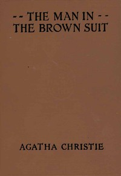

# The Man in the Brown Suit <kbd>v2.0.2</kbd>

## Authors

 - Christie, Agatha <small>(1890 - 1976)</small>

## Translators

## Subjects

 - Detective and mystery stories
 - London (England)
 - Murder
 - South Africa
 - Women adventurers

## Readablility

 - **A1:** 55%
 - **A2:** 62%
 - **B1:** 72%
 - **B2:** 85%
 - **C1:** 88%
 - **C2:** 100%

## Words Count

 - **A1:** 558
 - **A2:** 540
 - **B1:** 881
 - **B2:** 1360
 - **C1:** 579
 - **C2:** 3291

## Source

<kbd>GUTHENBURGE:61168</kbd>
