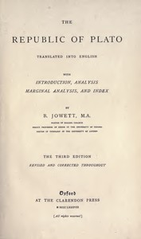

# The Republic of Plato <kbd>v2.2.1</kbd>

## Authors

 - Plato <small>(-428 - -348)</small>

## Translators

 - Jowett, Benjamin <small>(1817 - 1893)</small>

## Subjects

 - Justice
 - Political science
 - Utopias

## Readablility

 - **A1:** 77%
 - **A2:** 83%
 - **B1:** 89%
 - **B2:** 94%
 - **C1:** 98%
 - **C2:** 100%

## Words Count

 - **A1:** 492
 - **A2:** 470
 - **B1:** 907
 - **B2:** 1563
 - **C1:** 2123
 - **C2:** 1588

## Source

<kbd>GUTHENBURGE:55201</kbd>
