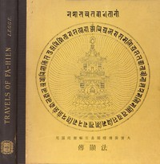

# A Record of Buddhistic Kingdoms: Being an account by the Chinese monk Fa-hsien of travels in India and Ceylon (A.D. 399-414) in search of the Buddhist books of discipline <kbd>v2.3.0</kbd>

## Authors

 - Faxian <small>(-1 - -1)</small>

## Translators

 - Legge, James <small>(1815 - 1897)</small>

## Subjects

 - Asia
 - Buddhism
 - Buddhist pilgrims and pilgrimages

## Readablility

 - **A1:** 76%
 - **A2:** 82%
 - **B1:** 88%
 - **B2:** 93%
 - **C1:** 98%
 - **C2:** 100%

## Words Count

 - **A1:** 477
 - **A2:** 418
 - **B1:** 686
 - **B2:** 943
 - **C1:** 953
 - **C2:** 503

## Source

<kbd>GUTHENBURGE:2124</kbd>
