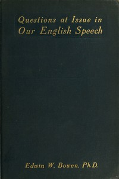

# Questions at Issue in Our English Speech <kbd>v2.3.0</kbd>

## Authors

 - Bowen, Edwin W. (Edwin Winfield) <small>(1866 - 1953)</small>

## Translators

## Subjects

 - English language

## Readablility

 - **A1:** 71%
 - **A2:** 77%
 - **B1:** 84%
 - **B2:** 90%
 - **C1:** 95%
 - **C2:** 100%

## Words Count

 - **A1:** 464
 - **A2:** 376
 - **B1:** 609
 - **B2:** 871
 - **C1:** 960
 - **C2:** 713

## Source

<kbd>GUTHENBURGE:67953</kbd>
