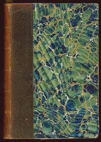

# Les Misérables <kbd>v2.1.0</kbd>

## Authors

 - Hugo, Victor <small>(1802 - 1885)</small>

## Translators

 - Hapgood, Isabel Florence <small>(1850 - 1928)</small>

## Subjects

 - Epic literature
 - Ex-convicts
 - Historical fiction
 - Orphans
 - Paris (France)

## Readablility

 - **A1:** 66%
 - **A2:** 72%
 - **B1:** 77%
 - **B2:** 83%
 - **C1:** 85%
 - **C2:** 100%

## Words Count

 - **A1:** 943
 - **A2:** 873
 - **B1:** 1516
 - **B2:** 2441
 - **C1:** 1005
 - **C2:** 16793

## Source

<kbd>GUTHENBURGE:135</kbd>
