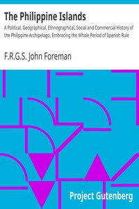

# The Philippine Islands: A Political, Geographical, Ethnographical, Social and Commercial History of the Philippine Archipelago, Embracing the Whole Period of Spanish Rule <kbd>v2.3.0</kbd>

## Authors

 - Foreman, John, F.R.G.S. <small>(-1 - -1)</small>

## Translators

## Subjects

 - Philippines

## Readablility

 - **A1:** 70%
 - **A2:** 76%
 - **B1:** 83%
 - **B2:** 90%
 - **C1:** 96%
 - **C2:** 100%

## Words Count

 - **A1:** 494
 - **A2:** 492
 - **B1:** 970
 - **B2:** 1818
 - **C1:** 2962
 - **C2:** 2931

## Source

<kbd>GUTHENBURGE:22815</kbd>
