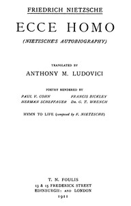

# Ecce Homo: Complete Works, Volume Seventeen <kbd>v2.0.2</kbd>

## Authors

 - Nietzsche, Friedrich Wilhelm <small>(1844 - 1900)</small>

## Translators

 - Ludovici, Anthony M. (Anthony Mario) <small>(1882 - 1971)</small>
 - Cohn, Paul V. (Paul Victor) <small>(-1 - -1)</small>

## Subjects

 - Nietzsche, Friedrich Wilhelm, 1844-1900
 - Philosophers

## Readablility

 - **A1:** 50%
 - **A2:** 57%
 - **B1:** 67%
 - **B2:** 82%
 - **C1:** 86%
 - **C2:** 100%

## Words Count

 - **A1:** 546
 - **A2:** 479
 - **B1:** 792
 - **B2:** 1255
 - **C1:** 531
 - **C2:** 3368

## Source

<kbd>GUTHENBURGE:52190</kbd>
