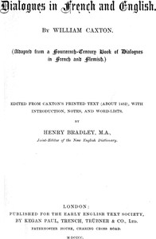

# Dialogues in French and English <kbd>v2.2.1</kbd>

## Authors

 - Caxton, William <small>(-1 - 1491)</small>

## Translators

## Subjects

 - Dialogues, English (Middle)
 - Dialogues, French
 - English language
 - French language

## Readablility

 - **A1:** 82%
 - **A2:** 85%
 - **B1:** 89%
 - **B2:** 93%
 - **C1:** 95%
 - **C2:** 99%

## Words Count

 - **A1:** 378
 - **A2:** 223
 - **B1:** 334
 - **B2:** 399
 - **C1:** 379
 - **C2:** 317

## Source

<kbd>GUTHENBURGE:29214</kbd>
