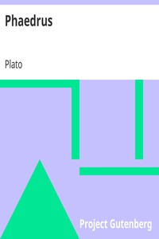

# Phaedrus <kbd>v2.2.1</kbd>

## Authors

 - Plato <small>(-428 - -348)</small>

## Translators

 - Jowett, Benjamin <small>(1817 - 1893)</small>

## Subjects

 - Classical literature
 - Love
 - Lysias
 - Rhetoric
 - Rhetoric, Ancient
 - Socrates, 470 BC-399 BC
 - Soul

## Readablility

 - **A1:** 77%
 - **A2:** 83%
 - **B1:** 88%
 - **B2:** 94%
 - **C1:** 98%
 - **C2:** 100%

## Words Count

 - **A1:** 469
 - **A2:** 392
 - **B1:** 650
 - **B2:** 911
 - **C1:** 878
 - **C2:** 435

## Source

<kbd>GUTHENBURGE:1636</kbd>
