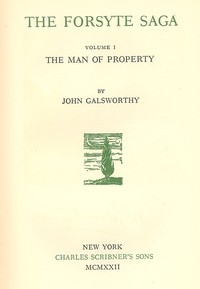

# The Forsyte Saga - Complete <kbd>v2.3.0</kbd>

## Authors

 - Galsworthy, John <small>(1867 - 1933)</small>

## Translators

## Subjects

 - Domestic fiction
 - England
 - England
 - Families
 - Forsyte family (Fictitious characters)
 - Middle class
 - Women

## Readablility

 - **A1:** 78%
 - **A2:** 84%
 - **B1:** 89%
 - **B2:** 94%
 - **C1:** 98%
 - **C2:** 100%

## Words Count

 - **A1:** 494
 - **A2:** 494
 - **B1:** 972
 - **B2:** 1809
 - **C1:** 2794
 - **C2:** 2664

## Source

<kbd>GUTHENBURGE:4397</kbd>
