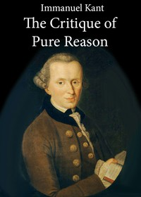

# The Critique of Pure Reason <kbd>v2.2.1</kbd>

## Authors

 - Kant, Immanuel <small>(1724 - 1804)</small>

## Translators

 - Meiklejohn, J. M. D. (John Miller Dow) <small>(1830 - 1902)</small>

## Subjects

 - Causation
 - Knowledge, Theory of
 - Philosophy, German
 - Reason

## Readablility

 - **A1:** 72%
 - **A2:** 78%
 - **B1:** 85%
 - **B2:** 92%
 - **C1:** 97%
 - **C2:** 100%

## Words Count

 - **A1:** 455
 - **A2:** 372
 - **B1:** 659
 - **B2:** 998
 - **C1:** 1215
 - **C2:** 906

## Source

<kbd>GUTHENBURGE:4280</kbd>
