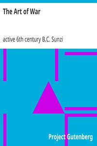

# The Art of War <kbd>v2.0.2</kbd>

## Authors

 - Sunzi, active 6th century B.C. <small>(-1 - -1)</small>

## Translators

 - Giles, Lionel <small>(1875 - 1958)</small>

## Subjects

 - Military art and science
 - War

## Readablility

 - **A1:** 47%
 - **A2:** 55%
 - **B1:** 69%
 - **B2:** 85%
 - **C1:** 89%
 - **C2:** 100%

## Words Count

 - **A1:** 345
 - **A2:** 278
 - **B1:** 431
 - **B2:** 553
 - **C1:** 196
 - **C2:** 798

## Source

<kbd>GUTHENBURGE:17405</kbd>
