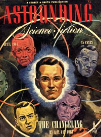

# The Long Way <kbd>v2.3.0</kbd>

## Authors

 - Smith, George O. (George Oliver) <small>(1911 - 1981)</small>

## Translators

## Subjects

 - Engineers
 - Lawyers
 - Science fiction
 - Space stations
 - Technology

## Readablility

 - **A1:** 73%
 - **A2:** 79%
 - **B1:** 86%
 - **B2:** 91%
 - **C1:** 97%
 - **C2:** 100%

## Words Count

 - **A1:** 422
 - **A2:** 262
 - **B1:** 360
 - **B2:** 400
 - **C1:** 374
 - **C2:** 225

## Source

<kbd>GUTHENBURGE:68003</kbd>
