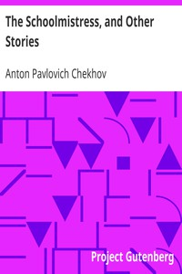

# The Schoolmistress, and Other Stories <kbd>v2.2.1</kbd>

## Authors

 - Chekhov, Anton Pavlovich <small>(1860 - 1904)</small>

## Translators

## Subjects

 - Chekhov, Anton Pavlovich, 1860-1904
 - Russia
 - Short stories

## Readablility

 - **A1:** 75%
 - **A2:** 82%
 - **B1:** 88%
 - **B2:** 93%
 - **C1:** 98%
 - **C2:** 100%

## Words Count

 - **A1:** 486
 - **A2:** 465
 - **B1:** 781
 - **B2:** 1142
 - **C1:** 1282
 - **C2:** 752

## Source

<kbd>GUTHENBURGE:1732</kbd>
