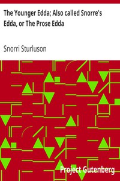

# The Younger Edda; Also called Snorre's Edda, or The Prose Edda <kbd>v2.3.0</kbd>

## Authors

 - Snorri Sturluson <small>(-1 - 1241)</small>

## Translators

 - Anderson, Rasmus Björn <small>(1846 - 1936)</small>

## Subjects

 - Mythology, Norse
 - Scalds and scaldic poetry

## Readablility

 - **A1:** 79%
 - **A2:** 84%
 - **B1:** 89%
 - **B2:** 94%
 - **C1:** 98%
 - **C2:** 100%

## Words Count

 - **A1:** 486
 - **A2:** 435
 - **B1:** 760
 - **B2:** 1000
 - **C1:** 996
 - **C2:** 562

## Source

<kbd>GUTHENBURGE:18947</kbd>
