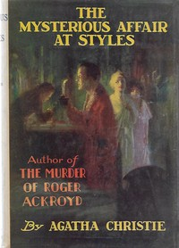

# The Mysterious Affair at Styles <kbd>GUTHENBURGE</kbd>

## Authors

 - Christie, Agatha <small>(1890 - 1976)</small>

## Translators

## Subjects

 - Belgians
 - Detective and mystery stories
 - Poirot, Hercule (Fictitious character)
 - Private investigators

## Readablility

 - **A1:** 50%
 - **A2:** 62%
 - **B1:** 76%
 - **B2:** 87%
 - **C1:** 96%
 - **C2:** 100%

## Words Count

 - **A1:** 398
 - **A2:** 422
 - **B1:** 728
 - **B2:** 987
 - **C1:** 992
 - **C2:** 612
