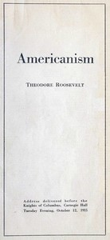

# Americanism <kbd>v2.2.1</kbd>

## Authors

 - Roosevelt, Theodore <small>(1858 - 1919)</small>

## Translators

## Subjects

 - Americanization
 - Citizenship

## Readablility

 - **A1:** 71%
 - **A2:** 78%
 - **B1:** 86%
 - **B2:** 93%
 - **C1:** 98%
 - **C2:** 100%

## Words Count

 - **A1:** 338
 - **A2:** 195
 - **B1:** 299
 - **B2:** 353
 - **C1:** 261
 - **C2:** 90

## Source

<kbd>GUTHENBURGE:68152</kbd>
