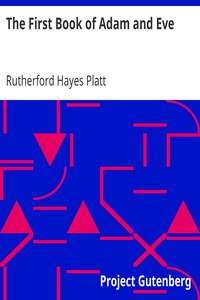

# The First Book of Adam and Eve <kbd>v2.3.0</kbd>

## Authors

 - Platt, Rutherford Hayes <small>(1894 - 1975)</small>

## Translators

## Subjects

 - Adam (Biblical figure)
 - Apocryphal books (Old Testament)
 - Eve (Biblical figure)

## Readablility

 - **A1:** 80%
 - **A2:** 85%
 - **B1:** 90%
 - **B2:** 95%
 - **C1:** 99%
 - **C2:** 100%

## Words Count

 - **A1:** 443
 - **A2:** 308
 - **B1:** 443
 - **B2:** 516
 - **C1:** 387
 - **C2:** 139

## Source

<kbd>GUTHENBURGE:398</kbd>
