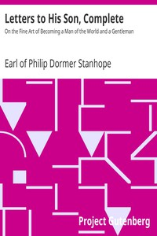

# Letters to His Son, Complete: On the Fine Art of Becoming a Man of the World and a Gentleman <kbd>v2.3.0</kbd>

## Authors

 - Chesterfield, Philip Dormer Stanhope, Earl of <small>(1694 - 1773)</small>

## Translators

## Subjects

 - Conduct of life

## Readablility

 - **A1:** 79%
 - **A2:** 85%
 - **B1:** 90%
 - **B2:** 94%
 - **C1:** 98%
 - **C2:** 100%

## Words Count

 - **A1:** 494
 - **A2:** 476
 - **B1:** 914
 - **B2:** 1534
 - **C1:** 2148
 - **C2:** 1826

## Source

<kbd>GUTHENBURGE:3361</kbd>
